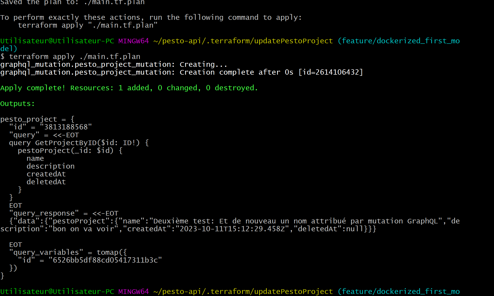
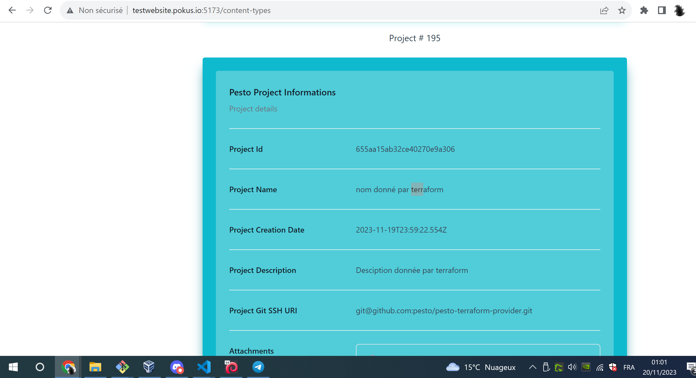

# What about

GraphQL Apollo has the ability to federate APIs, and the question is, cna i terraform several different APIs using one single terraform provider like [This one](https://registry.terraform.io/providers/sullivtr/graphql/latest/docs)

## Run it

Ok, now it all works, here is how to do it all:


### Clean all

```bash
rm -f *.tfstate || true
rm -f *.tfplan || true

```

### Prepare the terraform ops

```bash
rm -f *.tfstate || true
rm -f *.tfplan || true

export TF_LOG=DEBUG

terraform providers

terraform init

terraform fmt
terraform validate


```

### Create the Pesto Project

```bash

export TF_LOG=DEBUG

terraform plan -out ./provision.the.pesto.project.tf.plan
terraform apply ./provision.the.pesto.project.tf.plan


```

### Update The Pesto Project

* Change the description of the project from the `` resource
* And run:

```bash

terraform plan -out ./update.the.pesto.project.tf.plan
terraform apply ./update.the.pesto.project.tf.plan

```

### Delete the Pesto project

```bash

terraform plan -destroy -out ./destroy.the.pesto.project.tf.plan
terraform apply ./destroy.the.pesto.project.tf.plan

```

### And do it all over again (modify the graphQL files)

If you modify the graphQL files, you ahve to 

### Add on: teraform `import`

TODO

<!-- 
## ANNEX: Old tests

```bash
terraform providers

terraform init

terraform fmt
terraform validate


export TF_LOG=DEBUG

terraform plan -out ./main.tf.plan
terraform apply ./main.tf.plan

# ---
# destroy and create again one liner :
# - 
# terraform plan -destroy -out ./main.destroy.tf.plan && terraform apply ./main.destroy.tf.plan && terraform plan -out ./main.tf.plan && terraform apply ./main.tf.plan


```

Woww!!





WHERE I AM NOW :

J'ai juste qlq changments suppélemtaires à faire qui concernent un certain bâtiment!

* Le terraorm destroy déclenche la mutation delete
* Le terraform apply déclenchera une création, ou un update, en fonction de l'état terraform (terraform state).

Sur la question, cette issue github est intéressante: https://github.com/sullivtr/terraform-provider-graphql/issues/36

Alright, now, If right after terraform creates the pesto project, i try to terraform destroy it, i got  problem with the ID of the project, set to an empty string in the `id` field declared in the  `read_query_variables` block:

```bash
$ terraform plan -destroy -out ./main.destroy.tf.plan && terraform apply ./main.destroy.tf.plan
data.graphql_query.get_pesto_project_query: Reading...
graphql_mutation.pesto_project_example1: Refreshing state... [id=2322205397]
data.graphql_query.get_pesto_project_query: Read complete after 0s [id=2694010551]
╷
│ Error: graphql server error: PESTO-PROJECT DATA SERVICE [GET PestoProject BY ID] method - It is impossible to find any [PestoProject] with an empty string as PROJECT ID, the provided PROJECT ID is the empty string: /pesto-project/:id = []
│
│   with graphql_mutation.pesto_project_example1,
│   on main.tf line 2, in resource "graphql_mutation" "pesto_project_example1":
│    2: resource "graphql_mutation" "pesto_project_example1" {
│
│ graphql server error: PESTO-PROJECT DATA SERVICE [GET PestoProject BY ID]
│ method - It is impossible to find any [PestoProject] with an empty string
│ as PROJECT ID, the provided PROJECT ID is the empty string:
│ /pesto-project/:id = []
╵
```

* Now to solve that problem, I tried naively to change the `read_query_variables`, so that the `id` variable declaration is not set to an empty string :

```Hcl
  read_query_variables = {
    # "id" = "655aa15ab32ce40270e9a306" # "${var.pesto_project_id}"
    "id" = "${graphql_mutation.pesto_project_example1.compute_mutation_keys.id}"
    # "id" = ""
  }
```

* And I get an error, because the resource self references :

```bash
$ terraform plan -destroy -out ./main.destroy.tf.plan && terraform apply ./main.destroy.tf.plan
data.graphql_query.get_pesto_project_query: Reading...
data.graphql_query.get_pesto_project_query: Read complete after 0s [id=681099646]
╷
│ Error: Self-referential block
│
│   on main.tf line 32, in resource "graphql_mutation" "pesto_project_example1":
│   32:     "id" = "${graphql_mutation.pesto_project_example1.compute_mutation_keys.id}"
│
│ Configuration for graphql_mutation.pesto_project_example1 may not refer to
│ itself.
╵
╷
│ Error: Self-referential block
│
│   on main.tf line 32, in resource "graphql_mutation" "pesto_project_example1":
│   32:     "id" = "${graphql_mutation.pesto_project_example1.compute_mutation_keys.id}"
│
│ Configuration for graphql_mutation.pesto_project_example1 may not refer to
│ itself.
╵
```

* So I changed again trying to use the terraform remote state as a data source, provided that I have the provisioned Project ID in the output, when I creatd the project

* In the `output.tf`, I have :

```Hcl

```

* In the `main.tf`, I have :

```Hcl
  read_query_variables = {
    # "id" = "655aa15ab32ce40270e9a306" # "${var.pesto_project_id}"
    "id" = "${data.remote_state.graphql_mutation.pesto_project_example1.compute_mutation_keys.id}"
    # "id" = ""
  }
```

* And I got : 

```bash

```

-->

## Let's have fun now: Run Atlantis

Ok now we will have fun:

* Now, let's setup a minio, to store the terraform remote state into a minio bucket.
* let's setup run atlantis to manage the state of my Pesto envrionment. This will help automating tests
* Then, I will create terrafrom module that i will store into the citizen private terraform registry: simple modules, resuable for a series of different test setups. 
* Then I will dive again into developing in Golang 2 different terraform providers :
  * a first one will be a graphQL one (it's soooo useful!). I will think about this: is it a good idea to delop a cloud provider using graphQL?
  * Then I will develop a Pesto Specific terraform provider.

## References

* The GraphQL provider :
  * https://registry.terraform.io/providers/sullivtr/graphql/latest/docs
  * https://github.com/sullivtr/terraform-provider-graphql