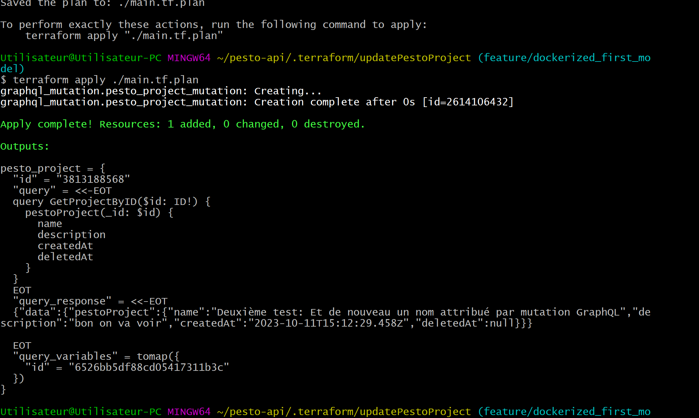
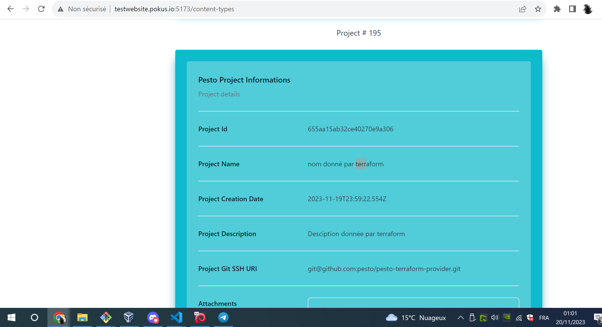

# What about

GraphQL Apollo has the ability to federate APIs, and the question is, cna i terraform several different APIs using one single terraform provider like [This one](https://registry.terraform.io/providers/sullivtr/graphql/latest/docs)

## Run it

```bash

terraform providers

terraform init

terraform fmt
terraform validate

terraform plan -out ./main.tf.plan
terraform apply ./main.tf.plan

terraform plan -destroy -out ./main.destroy.tf.plan
terraform apply ./main.destroy.tf.plan


```

Woww!!





WHERE I AM NOW : 

J'ai juste qlq changments suppélemtaires à faire qui concernent un certain bâtiment!

* Le terraorm destroy déclenche la mutation delete
* Le terraform apply déclenchera une création, ou un update, en fonction de l'état terraform (terraform state).


## References

* Th GraphQL provider :
  * https://registry.terraform.io/providers/sullivtr/graphql/latest/docs
  * https://github.com/sullivtr/terraform-provider-graphql