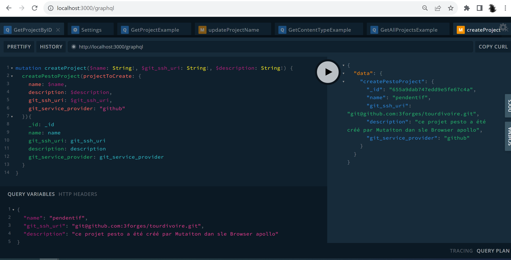
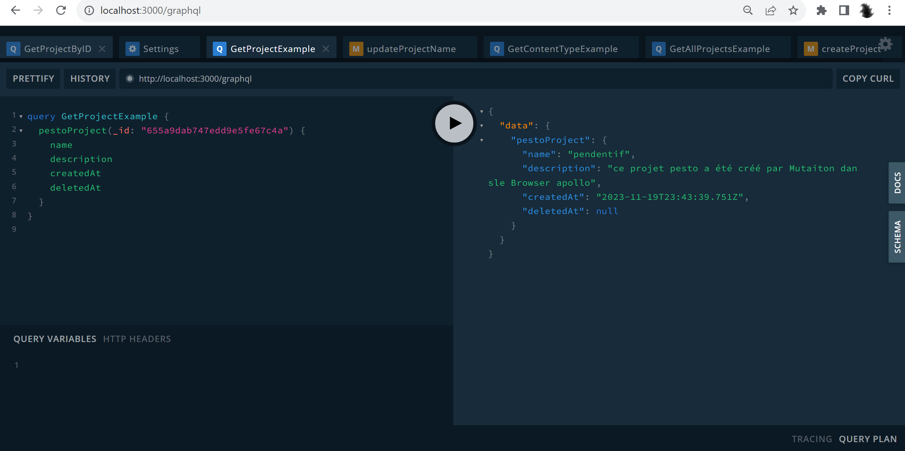
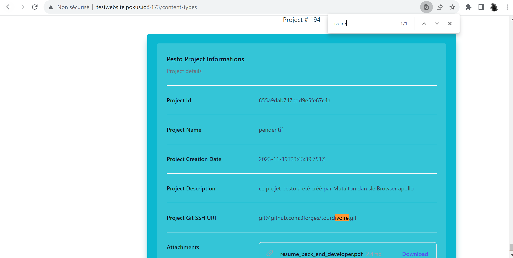
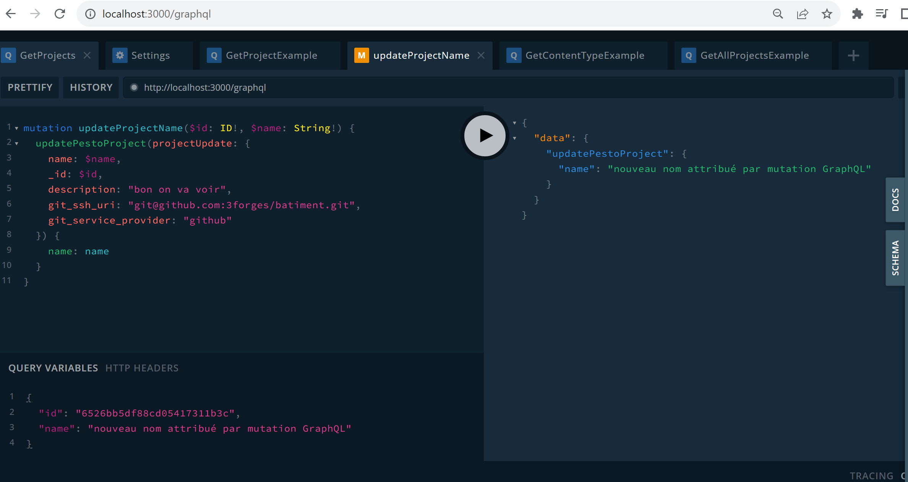
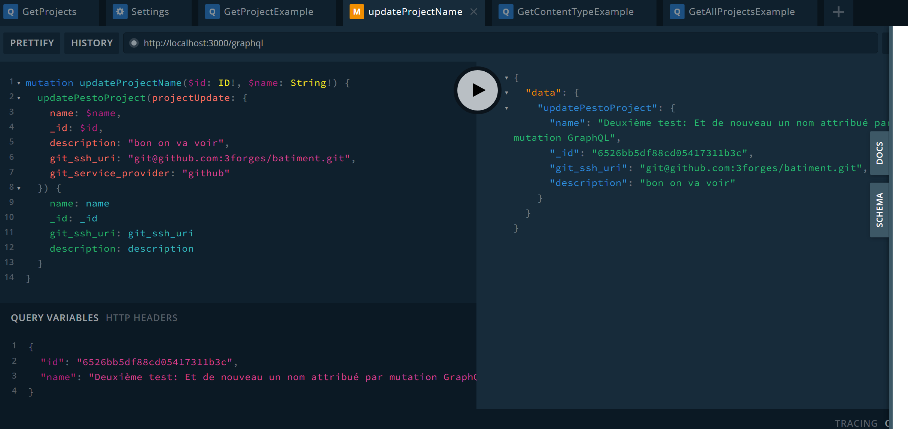
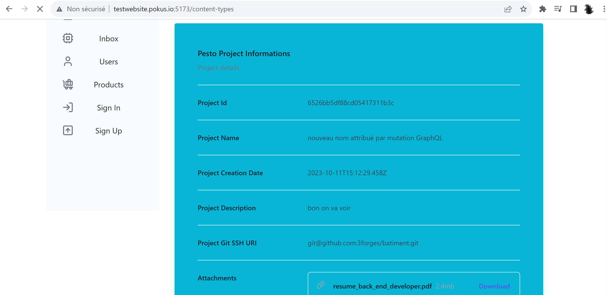

# The `Pesto API`

The Pesto API has a double face :

* It's available as a `REST API`,
* And it's available as a `GraphQL` API,

## Run the `Pesto API` locally

### The infrastructure

To run `Pesto API`, with the `Pesto UI`, Locally, you need:

* One Hardware Machine, basically your everyday dev machine, on which you will run both `Pesto UI` and `Pesto API`. The `Pesto API` uses a `MongoDB` database, which will run on a different machine than the `Pesto API`, a VirtualBox VM.
* One VirtualBox VM on which you will run the `MongoDB`, database of the `Pesto API`.
* To configure 3 DNS names: one DNS name for `Pesto API`, one DNS name for `Pesto UI`, and one DNS name for the `MongoDB` database service.

#### Configuring DNS names

* On the Hardware Machine where you run both  `Pesto API` and  `Pesto API`, if it is Windows, in git bash:

```bash

# --- 
# IP address of the VM on which the Mongo DB runs
export IPADDR_OF_YOUR_VM="192.168.37.202"
# --- 
# IP address of the Machine on which the UI and API run
export IPADDR_OF_YOUR_HWMACHINE="192.168.37.236"
# ---
# Add the host for the machine hosting your MongoDB
export PESTO_MONGO_HOST=mongo.pesto.io
echo "# ---- " | sudo tee -a /c/Windows/System32/drivers/etc/hosts
echo "${IPADDR_OF_YOUR_VM}      ${PESTO_MONGO_HOST}" | tee -a /c/Windows/System32/drivers/etc/hosts
export PESTO_UI_FQDN=ui.pesto.io
echo "# ---- " | sudo tee -a /c/Windows/System32/drivers/etc/hosts
echo "${IPADDR_OF_YOUR_HWMACHINE}      ${PESTO_UI_FQDN}" | tee -a /c/Windows/System32/drivers/etc/hosts
export PESTO_API_FQDN=api.pesto.io
echo "# ---- " | sudo tee -a /c/Windows/System32/drivers/etc/hosts
echo "${IPADDR_OF_YOUR_HWMACHINE}      ${PESTO_API_FQDN}" | tee -a /c/Windows/System32/drivers/etc/hosts
# ---
# if you're dhcp, you will need to update the IP Addresses everytime the DHCP server updates the IP Addresses of the machines you run Pesto API and Pesto UI on:  


# --- # --- # --- # --- # --- # --- # --- # --- # --- #
# -- UPDATING IP ADDRESS OF THE VM WHERE MONGO DB RUNS
# --- # --- # --- # --- 
# -- 
export OLD_IPADDR_OF_YOUR_VM="192.168.174.202"
export IPADDR_OF_YOUR_VM="192.168.37.202"
sed -i "s#${OLD_IPADDR_OF_YOUR_VM}#${IPADDR_OF_YOUR_VM}#g" /c/Windows/System32/drivers/etc/hosts

# --- # --- # --- # --- # --- # --- # --- # --- # --- #
# -- UPDATING IP ADDRESS OF THE HARDWARE MACHINE 
# --- # --- # --- # --- 
# - WHERE I HAVE MY [VSCODE] and I 
# - run locally the code in dev mode : 
# - Pesto API and the frontend
export OLD_IPADDR_OF_YOUR_HWMACHINE="192.168.225.236"
export IPADDR_OF_YOUR_HWMACHINE="192.168.37.236"
sed -i "s#${OLD_IPADDR_OF_YOUR_HWMACHINE}#${IPADDR_OF_YOUR_HWMACHINE}#g" /c/Windows/System32/drivers/etc/hosts

```

* On the VirtualBox VM where you run the MongoDB database used by the `Pesto API`, If this machine is a `GNU/Linux`, in bash shell:

```bash

# --- 
# IP address of the VM on which the Mongo DB runs
export IPADDR_OF_YOUR_VM="192.168.37.202"
# --- 
# IP address of the Machine on which the UI and API run
export IPADDR_OF_YOUR_HWMACHINE="192.168.37.236"
# ---
# Add the host for the machine hosting your MongoDB
export PESTO_MONGO_HOST=mongo.pesto.io
echo "# ---- " | sudo tee -a /etc/hosts
echo "${IPADDR_OF_YOUR_VM}      ${PESTO_MONGO_HOST}" | sudo tee -a /etc/hosts
export PESTO_UI_FQDN=ui.pesto.io
echo "# ---- " | sudo tee -a /etc/hosts
echo "${IPADDR_OF_YOUR_HWMACHINE}      ${PESTO_UI_FQDN}" | sudo tee -a /etc/hosts
export PESTO_API_FQDN=api.pesto.io
echo "# ---- " | sudo tee -a /etc/hosts
echo "${IPADDR_OF_YOUR_HWMACHINE}      ${PESTO_API_FQDN}" | sudo tee -a /etc/hosts
# ---
# if you're dhcp, you will need to update the IP Addresses everytime the DHCP server updates the IP Addresses of the machines you run Pesto API and Pesto UI on:  


# --- # --- # --- # --- # --- # --- # --- # --- # --- #
# -- UPDATING IP ADDRESS OF THE VM WHERE MONGO DB RUNS
# --- # --- # --- # --- 
# -- 
export OLD_IPADDR_OF_YOUR_VM="192.168.129.202"
export IPADDR_OF_YOUR_VM="192.168.37.202"
sed -i "s#${OLD_IPADDR_OF_YOUR_VM}#${IPADDR_OF_YOUR_VM}#g" /etc/hosts

# --- # --- # --- # --- # --- # --- # --- # --- # --- #
# -- UPDATING IP ADDRESS OF THE HARDWARE MACHINE 
# --- # --- # --- # --- 
# - WHERE I HAVE MY [VSCODE] and I 
# - run locally the code in dev mode : 
# - Pesto API and the frontend
export OLD_IPADDR_OF_YOUR_HWMACHINE="192.168.225.202"
export IPADDR_OF_YOUR_HWMACHINE="192.168.37.236"
sed -i "s#${OLD_IPADDR_OF_YOUR_HWMACHINE}#${IPADDR_OF_YOUR_HWMACHINE}#g" /etc/hosts

```

#### Start the database

Before starting `Pesto API` (and then `Pesto UI`), you need to provision a **MongoDB** database service on the VirtualBox VM.

* Git clone this repo in the VirtualBox VM, and run this:

```bash
# ---
# The FQDN you are going to configure in your :
#  /C/Windows/System32/drivers/etc/hosts
#  /etc/hosts
#  echo "${IPADDR_OF_YOUR_VM}      ${PESTO_MONGO_HOST}" | tee -a /C/Windows/System32/drivers/etc/hosts
#  echo "# ---- " | tee -a /C/Windows/System32/drivers/etc/hosts
# ---
# export PESTO_MONGO_HOST=mongo.pesto.io
# source ./../.env.sh
# docker-compose up -d

# ---
# or just : 
# export PESTO_MONGO_HOST=mongo.myhome.io
export PESTO_MONGO_HOST=mongo.pesto.io
pnpm run db:start

# ---
# To restart with an empty database
# export PESTO_MONGO_HOST=mongo.myhome.io
export PESTO_MONGO_HOST=mongo.pesto.io
pnpm run db:scratch

```

### Start the Pesto API

* Then you can then start the rest api from the `./pesto-api` folder:

```bash

# ---
# First, install the nestjs cli
npm install -g @nestjs/cli

#---
#
cd ./pesto-api

pnpm i

export PESTO_MONGO_HOST=mongo.pesto.io
export PESTO_API_HOST=api.pesto.io


# pnpm run ci:generate:env
pnpm run ci:env

source ./../.env.sh
pnpm start
```

Finally, you can now start the Pesto UI, see [the `Pesto UI` reporsitory](https://github.com/3forges/pesto-ui).

## Using the `GraphQL` API

Here are the working verified queries : 

### GraphQL API: working with _Pesto `Projects`_

#### **Create a Project** Mutation (with variables)

```GraphQL
mutation createProject($name: String!, $git_ssh_uri: String!, $description: String!) {
  createPestoProject(projectToCreate: {
    name: $name,
    description: $description,
    git_ssh_uri: $git_ssh_uri,
    git_service_provider: "github"
  }){
    _id: _id
    name: name
    git_ssh_uri: git_ssh_uri
    description: description
    git_service_provider: git_service_provider
  }
}
```

_Mutation Variables_ :

```GraphQL
{
  "name": "pendentif",
  "git_ssh_uri": "git@github.com:3forges/tourdivoire.git",
  "description": "ce projet pesto a été créé par Mutaiton dan sle Browser apollo"
}
```

The result of that create mutation in the appollo browser:







#### **Get all projects** Query

```GraphQL
query GetAllProjectsExample {
  getAllPestoProjects {
    _id
    name
    description
    git_ssh_uri
    git_service_provider
  }
}
```

#### **Get a project by ID** Query

```GraphQL
query GetProjectByID($id: ID!) {
  pestoProject(_id: $id) {
    name
    description
    createdAt
    deletedAt
  }
}
```

_Query Variables_ :

```GraphQL
{ "id": "6526bb5df88cd05417311b3c" }
```

#### **Update a Project** by ID Mutation (with variables)

```GraphQL
mutation updateProjectByID($id: ID!, $name: String!, $git_ssh_uri: String!, $description: String!) {
# mutation updateProjectName($id: ID!, $name: String!) {
  updatePestoProject(projectUpdate: {
    _id: $id,
    name: $name,
    # description: "bon on va voir",
    # git_ssh_uri: "git@github.com:3forges/batiment.git",
    description: $description,
    git_ssh_uri: $git_ssh_uri,
    git_service_provider: "github"
  }) {
    _id: _id
    name: name
    git_ssh_uri: git_ssh_uri
    description: description
    git_service_provider: git_service_provider
  }
}
```

_Mutation Variables_ :

```GraphQL
{
  "id": "65a279c5b51cdf03d306bf78",
  "name": "Je change le champs 'name' du projet  par mutation GraphQL",
  "git_ssh_uri": "git@github.com:3forges/nouvelle_valeur_de_git_ssh_uri.git",
  "description": "J'ai modifié la description de ce projet par le browser GraphQL Apollo"
}
```

The result of that update mutation in the appollo browser:








#### Delete a Project Mutation

Note this is a Very good example of nested response in a GraphQL Mutation

```GraphQL
mutation DeleteProjectByID($id: ID!) {
  deletePestoProject(_id: $id) {
    message
    deletedProject {
      _id
      name
      git_ssh_uri
      description
    }
  }
}
```

_Mutation Variables_ :

```GraphQL
{
  "id": "655a9dab747edd9e5fe67c4a"
}
```

### GraphQL API: working with _Pesto `Content-Types`_

TODO

## Using the REST API

### REST API: working with Pesto Projects

#### Create a Project

```bash
export PESTO_API_HTTP_SCHEME="http" # or "https"
export PESTO_API_HOST=api.pesto.io
export PESTO_API_PORT=3000
export PESTO_API_BASE_URL="${PESTO_API_HTTP_SCHEME}://${PESTO_API_HOST}:${PESTO_API_PORT}"

# ---
# This is how to create a new
# "Pesto Project", with a curl :
export PESTO_PRJ_GIT_SSH_URI='git@github.com:3forges/poc-redux-thunk.git'
export PESTO_PRJ_NAME='astroprojectWiddershins'
export PESTO_PRJ_DESC='Un premier projet pesto sur une base de projet astro, pour une doc Open API à la widdershins'

# export PESTO_PRJ_DESC_URL_ENCODED='Un%20premier%20projet%20pesto%20sur%20une%20base%20de%20projet%20astro%2C%20pour%20une%20doc%20Open%20API%20%C3%A0%20la%20widdershins'

export THE_PAYLOAD="{ 
  \"name\" : \"${PESTO_PRJ_NAME}\", \"description\" : \"${PESTO_PRJ_DESC_URL_ENCODED}\", \"git_ssh_uri\" : \"${PESTO_PRJ_GIT_SSH_URI}\"
}"


export THE_PAYLOAD='{"name":"astroprojectWiddershins","description":"Un premier projet pesto sur une base de projet astro, pour une doc Open API à la widdershins","git_ssh_uri":"git@github.com:3forges/poc-redux-thunk.git"}'

# echo "THE_PAYLOAD=[${THE_PAYLOAD}]"

curl -iv -X POST -H 'Content-Type: application/json; charset=UTF-8' -d "${THE_PAYLOAD}" -H 'Accept: application/json; charset=UTF-8' ${PESTO_API_BASE_URL}/pesto-project | tail -n 1 | jq .

# ---
# Git bash for windows users:
# -
# Note that you might notice something, that some of 
# the UTF-8 characters, might be turned into another 
# character, in the pesto app. 
# 
# For example, the character "à", might be 
# turned into a "�" character.
# 
# But when you create or update a new project using the
# Pesto UI, the characters are preserved properly.
# 
# Similarly, The Characters are well preserved when
# creating/updating a project using the Apollo GraphQL client.
# 
# - 
# This might be caused by Git bash for windows itself, which
# may have some issues with UTF-8
# https://stackoverflow.com/questions/10651975/unicode-utf-8-with-git-bash
# - 
```

#### **Get all projects**

```bash
export PESTO_API_HTTP_SCHEME="http" # or "https"
export PESTO_API_HOST=api.pesto.io
export PESTO_API_PORT=3000
export PESTO_API_BASE_URL="${PESTO_API_HTTP_SCHEME}://${PESTO_API_HOST}:${PESTO_API_PORT}"

# ---
# This is how to list all 
# "Pesto Projects", with a curl :

curl -iv -X GET -H 'Content-Type: application/json' -H 'Accept: application/json' ${PESTO_API_BASE_URL}/pesto-project | tail -n 1 | jq .

```

#### **Get a project by ID**

#### Get a project by Git SSH URI

```bash
export PESTO_API_HTTP_SCHEME="http" # or "https"
export PESTO_API_HOST=api.pesto.io
export PESTO_API_PORT=3000
export PESTO_API_BASE_URL="${PESTO_API_HTTP_SCHEME}://${PESTO_API_HOST}:${PESTO_API_PORT}"

# ---
# Get newly created project by Git SSH URI
export PESTO_PRJ_GIT_SSH_URI='git@github.com:3forges/awesome-obs.git'
export PESTO_PRJ_GIT_SSH_URI='git@github.com:3forges/poc-redux-thunk.git'
export PESTO_PRJ_GIT_SSH_URI='git@github.com:3forges/astro-widdershins.git'

export PESTO_PRJ_GIT_SSH_URI_URL_ENCODED='git%40github.com%3A3forges%2Fawesome-obs.git'
export PESTO_PRJ_GIT_SSH_URI_URL_ENCODED='git%40github.com%3A3forges%2Fpoc-redux-thunk.git'
export PESTO_PRJ_GIT_SSH_URI_URL_ENCODED='git%40github.com%3A3forges%2Fastro-widdershins.git'

curl -iv -X GET -H 'Content-Type: application/json' -H 'Accept: application/json' "${PESTO_API_BASE_URL}/pesto-project/uri/${PESTO_PRJ_GIT_SSH_URI_URL_ENCODED}" | tail -n 1 | jq .

```

#### **Update a Project** by ID

TODO

#### Delete a Project

```bash
export PESTO_API_HTTP_SCHEME="http" # or "https"
export PESTO_API_HOST=api.pesto.io
export PESTO_API_PORT=3000
export PESTO_API_BASE_URL="${PESTO_API_HTTP_SCHEME}://${PESTO_API_HOST}:${PESTO_API_PORT}"

export PESTO_PRJ_ID='65a437c050b3df1a9861e3a8'
curl -iv -X DELETE -H 'Content-Type: application/json' -H 'Accept: application/json' "${PESTO_API_BASE_URL}/pesto-project/${PESTO_PRJ_ID}" | tail -n 1 | jq .
```


* Then you can test using the `Pesto API`:
  * First, you create a Project:

```bash
curl -iv -X GET -H 'Accept: application/json' http://localhost:3000/ | tail -n 1 | jq .

# ---
# List all Entity instances
curl -iv -X GET -H 'Accept: application/json' http://localhost:3000/pesto-project | tail -n 1 | jq .

# ---
# This is how to create a new
# "Pesto Content Type", with a curl :
export PESTO_PRJ_GIT_SSH_URI='git@github.com:3forges/poc-redux-thunk.git'
export GIT_SSH_URI_URL_ENCODED='git%40github.com%3A3forges%2Fpoc-redux-thunk.git'

curl -iv -X POST -H 'Content-Type: application/json' -d "{ \"name\" : \"astroproject1\", \"description\" : \"un premier projet pesto sur une base de projet astro, mon site portfolio\", \"git_ssh_uri\" : \"${PESTO_PRJ_GIT_SSH_URI}\"}" -H 'Accept: application/json' http://localhost:3000/pesto-project | tail -n 1 | jq .


export PESTO_PRJ_GIT_SSH_URI='git@github.com:3forges/pesto-docs.git'
export GIT_SSH_URI_URL_ENCODED='git%40github.com%3A3forges%2Fpesto-docs.git'

curl -iv -X POST -H 'Content-Type: application/json' -d "{ \"name\" : \"astroprojectTwo2\", \"description\" : \"The pesto project documentation static website\", \"git_ssh_uri\" : \"${PESTO_PRJ_GIT_SSH_URI}\"}" -H 'Accept: application/json' http://localhost:3000/pesto-project | tail -n 1 | jq .

export GIT_SSH_URI_URL_ENCODED='git%40github.com%3A3forges%2Fawesome-obs.git'
export PESTO_PRJ_GIT_SSH_URI='git@github.com:3forges/awesome-obs.git'

curl -iv -X POST -H 'Content-Type: application/json' -d "{ \"name\" : \"Awesome Obs\", \"description\" : \"An awesome list, for the OBS livestreaming opensource tool\", \"git_ssh_uri\" : \"${PESTO_PRJ_GIT_SSH_URI}\"}" -H 'Accept: application/json' http://localhost:3000/pesto-project | tail -n 1 | jq .


# ---
# Get newly created project by name
export PESTO_PRJ_NAME="astroproject1"
curl -iv -X GET -H 'Accept: application/json' "http://localhost:3000/pesto-project/name/${PESTO_PRJ_NAME}" | tail -n 1 | jq .


export PESTO_PRJ_NAME="astroprojectTwo2"
curl -iv -X GET -H 'Accept: application/json' "http://localhost:3000/pesto-project/name/${PESTO_PRJ_NAME}" | tail -n 1 | jq .

# ---
# Get newly created project by Git SSH URI
export PESTO_PRJ_GIT_SSH_URI='git@github.com:3forges/awesome-obs.git'
export GIT_SSH_URI_URL_ENCODED='git%40github.com%3A3forges%2Fawesome-obs.git'

curl -iv -X GET -H 'Content-Type: application/json' -H 'Accept: application/json' "http://localhost:3000/pesto-project/uri/${GIT_SSH_URI_URL_ENCODED}" | tail -n 1 | jq .

export PESTO_PRJ_ID='652205f530323c2bbe4901c3'

# ---
# Now we try and update the [description]
# of the project, from its ID in
# Mongo Database
# ---
#
curl -iv -X PUT -H 'Content-Type: application/json' -d "{\"description\" : \"An absolutely awesome list, for the famous OBS livestreaming opensource tool\"}" -H 'Accept: application/json' "http://localhost:3000/pesto-project/${PESTO_PRJ_ID}" | tail -n 1 | jq .

curl -iv -X GET -H 'Content-Type: application/json' -H 'Accept: application/json' "http://localhost:3000/pesto-project/uri/${GIT_SSH_URI_URL_ENCODED}" | tail -n 1 | jq .

# ---
# Now we try and update the [title]
# of the project, from its ID in
# Mongo Database. But there is no
# [title] property in the DTO Type
# ---
# Expect: that the type validation fails with NestJs 'ValidationPipe'
curl -iv -X PUT -H 'Content-Type: application/json' -d "{\"title\" : \"Whatever i might come up with as an example title fo a pesto project\"}" -H 'Accept: application/json' "http://localhost:3000/pesto-project/${PESTO_PRJ_ID}" | tail -n 1 | jq .

curl -iv -X GET -H 'Content-Type: application/json' -H 'Accept: application/json' "http://localhost:3000/pesto-project/uri/${GIT_SSH_URI_URL_ENCODED}" | tail -n 1 | jq .

# ---
# Now we try and update the [name]
# of the project, from its ID in
# Mongo Database
# ---
#
curl -iv -X PUT -H 'Content-Type: application/json' -d "{\"name\" : \"The Defintive OBS awesome list\"}" -H 'Accept: application/json' "http://localhost:3000/pesto-project/${PESTO_PRJ_ID}" | tail -n 1 | jq .

curl -iv -X GET -H 'Content-Type: application/json' -H 'Accept: application/json' "http://localhost:3000/pesto-project/uri/${GIT_SSH_URI_URL_ENCODED}" | tail -n 1 | jq .

# ---
# Now we try and delete a
# project, from its ID in Mongo Database
# ---
#
export PESTO_PRJ_ID='65217f712b21e8249d82ab51'
curl -iv -X DELETE -H 'Content-Type: application/json' -H 'Accept: application/json' "http://localhost:3000/pesto-project/${PESTO_PRJ_ID}" | tail -n 1 | jq .

```

- Then, you can create `PestoContentType`s:

```bash
curl -iv -X GET -H 'Accept: application/json' http://localhost:3000/ | tail -n 1 | jq .

# ---
# List all Entity instances
curl -iv -X GET -H 'Accept: application/json' http://localhost:3000/pesto-content-type | tail -n 1 | jq .

# ---
#  >>> I FIRST CREATE PESTO CONTENT TYPES
#      THAT ARE RELATED TO NON EXISTING
#      PESTO PROJECTS
# This is how to create a new
# "Pesto Content Type", with a curl :
curl -iv -X POST -H 'Content-Type: application/json' -d '{ "title" : "chaussure", "description" : "un autre type de contenu pour mon site de e-commerce", "identifier" : "chaussure", "project_id" : "rubbishprjid1"}' -H 'Accept: application/json' http://localhost:3000/pesto-content-type | tail -n 1 | jq .

curl -iv -X POST -H 'Content-Type: application/json' -d '{ "title" : "robe", "description" : "un autre type de contenu pour mon site de e-commerce", "identifier" : "robe", "project_id" : "rubbishprjid1"}' -H 'Accept: application/json' http://localhost:3000/pesto-content-type | tail -n 1 | jq .


curl -iv -X POST -H 'Content-Type: application/json' -d '{ "title" : "collier", "description" : "un autre type de contenu pour mon site de e-commerce", "identifier" : "collier", "project_id" : "rubbishprjid1"}' -H 'Accept: application/json' http://localhost:3000/pesto-content-type | tail -n 1 | jq .

curl -iv -X POST -H 'Content-Type: application/json' -d '{ "title" : "chapeau", "description" : "un autre type de contenu pour mon site de e-commerce", "identifier" : "chapeau", "project_id" : "rubbishprjid7"}' -H 'Accept: application/json' http://localhost:3000/pesto-content-type | tail -n 1 | jq .

# ---
# List all Entity instances
curl -iv -X GET -H 'Accept: application/json' http://localhost:3000/pesto-content-type | tail -n 1 | jq .


# ---
#  >>> I THEN CREATE PESTO CONTENT TYPES
#      THAT ARE RELATED TO EXISTING
#      PESTO PROJECTS
#
export PESTO_PRJ_ID="652180e1b90cf34b86350aa9"

# -
export REQ_PAYLOAD="{ \"title\" : \"chaussure\", \"description\" : \"un autre type de contenu pour mon site de e-commerce\", \"identifier\" : \"chaussure\", \"project_id\" : \"${PESTO_PRJ_ID}\"}"

curl -iv -X POST -H 'Content-Type: application/json' -d "${REQ_PAYLOAD}" -H 'Accept: application/json' http://localhost:3000/pesto-content-type | tail -n 1 | jq .

# -
export REQ_PAYLOAD="{ \"title\" : \"robe\", \"description\" : \"un autre type de contenu pour mon site de e-commerce\", \"identifier\" : \"robe\", \"project_id\" : \"${PESTO_PRJ_ID}\"}"

curl -iv -X POST -H 'Content-Type: application/json' -d "${REQ_PAYLOAD}" -H 'Accept: application/json' http://localhost:3000/pesto-content-type | tail -n 1 | jq .

# -
export REQ_PAYLOAD="{ \"title\" : \"collier\", \"description\" : \"un autre type de contenu pour mon site de e-commerce\", \"identifier\" : \"collier\", \"project_id\" : \"${PESTO_PRJ_ID}\"}"

curl -iv -X POST -H 'Content-Type: application/json' -d "${REQ_PAYLOAD}" -H 'Accept: application/json' http://localhost:3000/pesto-content-type | tail -n 1 | jq .

# -
export REQ_PAYLOAD="{ \"title\" : \"chapeau\", \"description\" : \"un autre type de contenu pour mon site de e-commerce\", \"identifier\" : \"chapeau\", \"project_id\" : \"${PESTO_PRJ_ID}\"}"

curl -iv -X POST -H 'Content-Type: application/json' -d "${REQ_PAYLOAD}" -H 'Accept: application/json' http://localhost:3000/pesto-content-type | tail -n 1 | jq .


# ---
# This is how to delete a
# "Pesto Content Type", using
# its ID, and curl command :
export PESTO_CT_ID="65221946ef33390bae4dbcd3"

curl -iv -X DELETE -G \
     -d "id=${PESTO_CT_ID}" \
     "http://localhost:3000/pesto-content-type/${PESTO_CT_ID}" | tail -n 1 | jq .

# ---
# List all Entity instances
curl -iv -X GET -H 'Accept: application/json' http://localhost:3000/pesto-content-type | tail -n 1 | jq .


# ---
# Now let's try to update an
# existing pesto-content-type by [ID]
export PESTO_CT_ID="65214fb76a508e624578cb28"
export PESTO_CT_ID="65214fb76a508e624578cb29"
export PESTO_CT_ID="65220e8ac0840e5aa4173499"

curl -iv -X PUT -H 'Content-Type: application/json' -d '{ "title" : "chapeau", "description" : "je modifie la [description], le [identifier] et le [project_id] du type de contenu [chapeau] de mon site de e-commerce", "identifier" : "hat", "project_id" : "rubbishprjid97modified"}' -H 'Accept: application/json' "http://localhost:3000/pesto-content-type/${PESTO_CT_ID}" | tail -n 1 | jq .

# ---
# List all Entity instances
curl -iv -X GET -H 'Accept: application/json' http://localhost:3000/pesto-content-type | tail -n 1 | jq .


# ---
#  + - + NEW VERY IMPORTANT :
# ---
# Ok now we are going to list all
# [Pesto Content Types] for a given [Project ID]:
# ---
#
export PESTO_PRJ_ID="rubbishprjid3modified"
curl -iv -X GET -H 'Accept: application/json' "http://localhost:3000/pesto-content-type/project/${PESTO_PRJ_ID}" | tail -n 1 | jq .

export PESTO_PRJ_ID="rubbishprjid97modified"
curl -iv -X GET -H 'Accept: application/json' "http://localhost:3000/pesto-content-type/project/${PESTO_PRJ_ID}" | tail -n 1 | jq .

export PESTO_PRJ_ID="652180e1b90cf34b86350aa9"
curl -iv -X GET -H 'Accept: application/json' "http://localhost:3000/pesto-content-type/project/${PESTO_PRJ_ID}" | tail -n 1 | jq .

```

* And finally we can create `PestoContent`:

```bash

# ---
# list all content types, to
# choose among them or not
# ---
curl -iv -X GET -H 'Accept: application/json' http://localhost:3000/pesto-content-type | tail -n 1 | jq .
# ---
# list all projects types, to
# choose among them or not
# ---
curl -iv -X GET -H 'Accept: application/json' http://localhost:3000/pesto-project | tail -n 1 | jq .
# ---
# list all content, to
# choose among them or not
# ---
curl -iv -X GET -H 'Accept: application/json' http://localhost:3000/pesto-content | tail -n 1 | jq .
# ---
#  >>> I THEN CREATE PESTO CONTENT 
#      THAT ARE RELATED TO EXISTING
#      PESTO PROJECTS
#
export PESTO_PRJ_ID="rubbishprojectid1"
# ---
# the one below is wrong
export PESTO_PRJ_ID="65221b6358151424a778bab0"
# ---
# the one below is good
export PESTO_PRJ_ID="652269f22d466869b4a40d73"

# ---
# the one below is wrong
export PESTO_CT_ID='652180e1b81cf34b44350bb9'
# ---
# the one below is good
export PESTO_CT_ID='65221b6358376870a825bab0'

export PESTO_CONTENT_TEXT="# Mon premer markdown un premier contenu pour mon site de e-commerce"
export PESTO_CONTENT_NAME="Mon premier article sur mon site enfin"
# ---
#  required properties:
#   + name
#   + project_id
#   + content_type_id
# ---
#  optional properties:
#   + text :  the markdown content as a string
# -

export REQ_PAYLOAD="{ \"name\" : \"${PESTO_CONTENT_NAME}\", \"text\" : \"${PESTO_CONTENT_TEXT}\", \"content_type_id\" : \"${PESTO_CT_ID}\", \"project_id\" : \"${PESTO_PRJ_ID}\"}"

curl -iv -X POST -H 'Content-Type: application/json' -d "${REQ_PAYLOAD}" -H 'Accept: application/json' http://localhost:3000/pesto-content | tail -n 1 | jq .

# ---
# List all Entity instances, after creation
curl -iv -X GET -H 'Accept: application/json' http://localhost:3000/pesto-content | tail -n 1 | jq .

```

- And you can check the constraints to create a PestoContent, by running:

```bash
# ---
#  >>> I CREATE PESTO CONTENT 
#      THAT ARE RELATED TO EITHER :
#       - NON-EXISTING PESTO PROJECT
#       - EXISTING PESTO CONTENT TYPE
#
export PESTO_PRJ_ID="rubbishprojectid1"
# ---
# the one below is good
export PESTO_PRJ_ID="652269f22d466869b4a40d73"
# ---
# the one below is wrong
export PESTO_PRJ_ID="65221b6358151424a778bab0"

# ---
# the one below is wrong
export PESTO_CT_ID='652180e1b81cf34b44350bb9'
# ---
# the one below is good
export PESTO_CT_ID='65221b6358376870a825bab0'

export PESTO_CONTENT_TEXT="# Mon deuxieme markdown un deuxieme contenu pour mon site de e-commerce, qui ne sera pas enregistre, car soit le [project_id], soit le [content_type_id] ne sont pas corrects (exitants ds la base)"
export PESTO_CONTENT_NAME="Mon deuxieme article sur mon site"
# ---
#  required properties:
#   + name
#   + project_id
#   + content_type_id
# ---
#  optional properties:
#   + text :  the markdown content as a string
# -

export REQ_PAYLOAD="{ \"name\" : \"${PESTO_CONTENT_NAME}\", \"text\" : \"${PESTO_CONTENT_TEXT}\", \"content_type_id\" : \"${PESTO_CT_ID}\", \"project_id\" : \"${PESTO_PRJ_ID}\"}"

curl -iv -X POST -H 'Content-Type: application/json' -d "${REQ_PAYLOAD}" -H 'Accept: application/json' http://localhost:3000/pesto-content | tail -n 1 | jq .

# --- # --- # --- # --- # --- # --- # --- #
# --- # EXPECTED:
# --- # --- # --- # --- # --- # --- # --- #
# < HTTP/1.1 406 Not Acceptable
# < content-type: application/json; charset=utf-8
# < content-length: 261
# < Date: Sun, 08 Oct 2023 08:58:10 GMT
# < Connection: keep-alive
# < Keep-Alive: timeout=72
# <
# { [261 bytes data]
# 100   610  100   261  100   349  13118  17541 # --:--:-- --:--:-- --:--:-- 32105
# * Connection #0 to host localhost left intact
# {
# "statusCode": 406,
# "message": "PESTO-CONTENT DATA SERVICE [CREATE] method - No new [PestoContent] was created: No PestoProject of with project_id = [652180e1b81cf34b44350bb9] was found. A PestoContent cannot be created without an existing PestoProject."
# }
# 
# --- # --- # --- # --- # --- # --- # --- #
# --- # --- # --- # --- # --- # --- # --- #

# ---
# List all Entity instances, after creation
curl -iv -X GET -H 'Accept: application/json' http://localhost:3000/pesto-content | tail -n 1 | jq .


# ---
#  >>> I CREATE PESTO CONTENT 
#      THAT ARE RELATED TO EITHER :
#       - EXISTING PESTO PROJECT
#       - NON-EXISTING PESTO CONTENT TYPE
#
export PESTO_PRJ_ID="rubbishprojectid1"
# ---
# the one below is wrong
export PESTO_PRJ_ID="65221b6358151424a778bab0"
# ---
# the one below is good
export PESTO_PRJ_ID="652269f22d466869b4a40d73"

# ---
# the one below is good
export PESTO_CT_ID='65221b6358376870a825bab0'
# ---
# the one below is wrong
export PESTO_CT_ID='652180e1b81cf34b44350bb9'

export PESTO_CONTENT_TEXT="# Mon deuxieme markdown \n un deuxieme contenu pour mon site de e-commerce, qui ne sera pas enregistre, car soit le [project_id], soit le [content_type_id] ne sont pas corrects (exitants ds la base)"
export PESTO_CONTENT_NAME="Mon deuxieme article sur mon site"
# ---
#  required properties:
#   + name
#   + project_id
#   + content_type_id
# ---
#  optional properties:
#   + text :  the markdown content as a string
# -

export REQ_PAYLOAD="{ \"name\" : \"${PESTO_CONTENT_NAME}\", \"text\" : \"${PESTO_CONTENT_TEXT}\", \"content_type_id\" : \"${PESTO_CT_ID}\", \"project_id\" : \"${PESTO_PRJ_ID}\"}"

curl -iv -X POST -H 'Content-Type: application/json' -d "${REQ_PAYLOAD}" -H 'Accept: application/json' http://localhost:3000/pesto-content | tail -n 1 | jq .

# --- # --- # --- # --- # --- # --- # --- #
# --- # EXPECTED:
# --- # --- # --- # --- # --- # --- # --- #
# < HTTP/1.1 406 Not Acceptable
# < content-type: application/json; charset=utf-8
# < content-length: 261
# < Date: Sun, 08 Oct 2023 08:58:10 GMT
# < Connection: keep-alive
# < Keep-Alive: timeout=72
# <
# { [261 bytes data]
# 100   610  100   261  100   349  13118  17541 # --:--:-- --:--:-- --:--:-- 32105
# * Connection #0 to host localhost left intact
# {
# "statusCode": 406,
# "message": "PESTO-CONTENT DATA SERVICE [CREATE] method - No new [PestoContent] was created: No PestoContentType of with content_type_id = [652180e1b81cf34b44350bb9] was found. A PestoContent cannot be created without an existing content-type."
# }
# 
# --- # --- # --- # --- # --- # --- # --- #
# --- # --- # --- # --- # --- # --- # --- #

# --- 
# List all Entity instances, after creation
curl -iv -X GET -H 'Accept: application/json' http://localhost:3000/pesto-content | tail -n 1 | jq .

```

## Generate OpenAPI Docs

The Open API Documentation is served at export `http://<PESTO_API_HOST>:3000/api`

Run:

```bash
pnpm run generate:docs
```

You will get :

* The `openapi.json`
* A well enriched markdown file, `./pesto-api/pesto.widdershins.md`, which is no yet used to render a fully fledged static website, as beautiful docs to statically serve.

### OpenAPI Documentation: Next TODO

Ideas to serve the _widdershins_ docs:

* Idea 1:
  * I generate the `./pesto-api/pesto.widdershins.md` file using `pnpm run generate:docs`.
  * Then the problem is to render the `widdershins.md` file into HTML. Basically, historcally, only the Mermaid reslate tool can render that, see :
    * <https://github.com/Mermade/reslate>
    * <https://github.com/Mermade/widdershins>
    * <https://github.com/Mermade/widdershins/issues/223>
  * If reslate is too complicated/not well maintained, and not usable, then I think best is to create an astro website able to render beautifully the `widdershins.md`. I think it is achievable, because the generated `widdershins.md` is rather clean, and clear. Another option is to just use the `openapi.json` file, as an Astro data source, to generate the Astro Website. Maybe with 2 build steps: first generate many markdown files from the `openapi.json`, and then render all those MArkdown files as content files.
  * Once I have a solution to render the `widdershins.md`, I can serve the static content using <https://github.com/nestjs/serve-static>
  * Nota Bene: widdershins relies only on the content of the `openapi.json` file, So if i want to add examples, or anything in OpenAPI docs, I just need to change the `openapi.json`. To change the `openapi.json`, the best is to add annotations on the source code, using the annotations from the  `@nestjs/swagger`, in the Nest controllers.
  * Nota Bene: the only astro theme I found about Open API documentation is not well supported, see <https://github.com/sarasate/gate>
