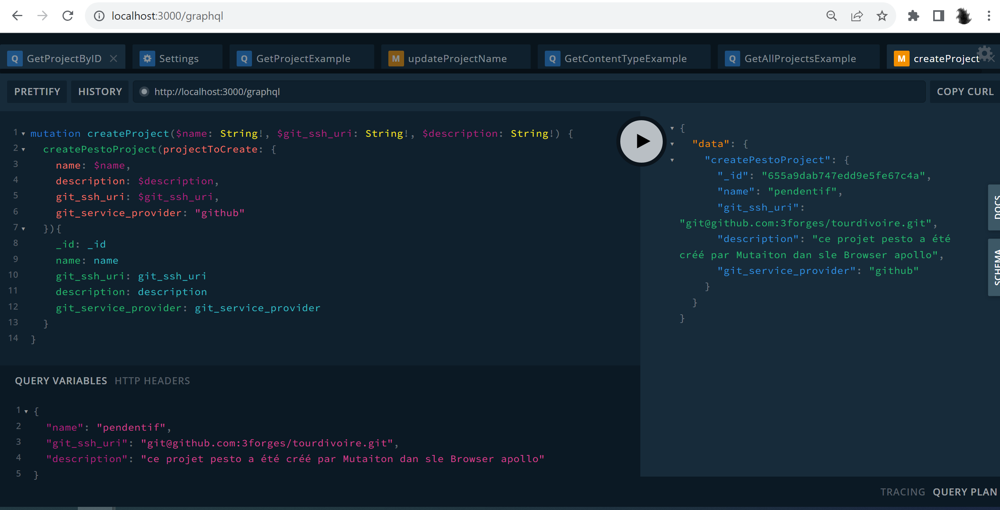
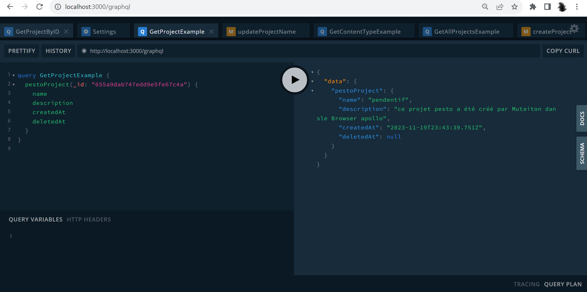
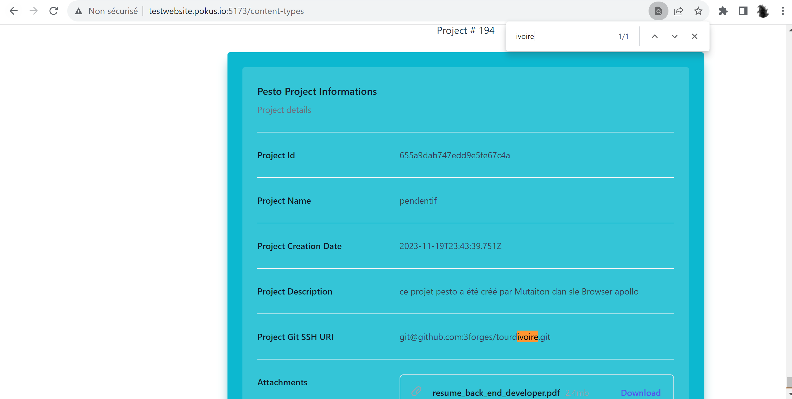
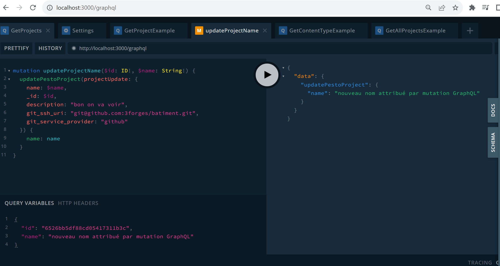
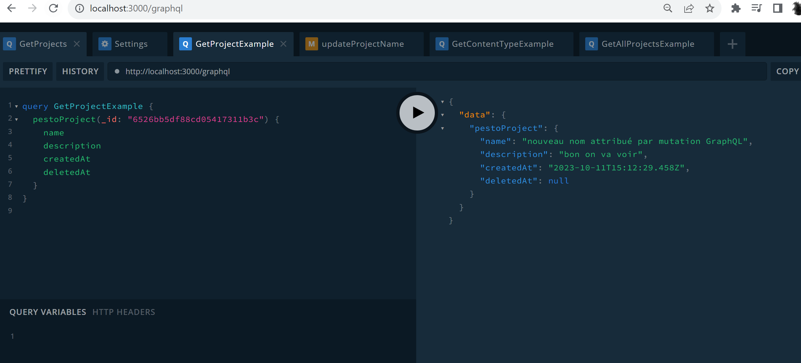
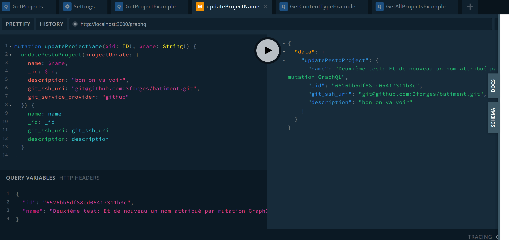
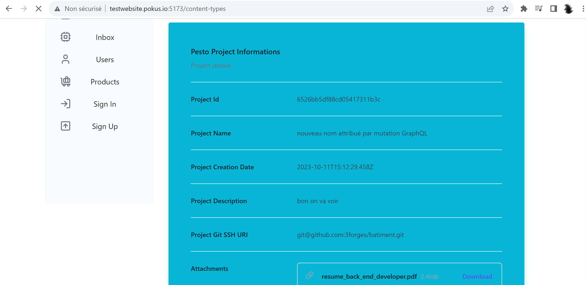

# Using the Pesto API: Pesto _`Content Type`s_

## Using the `GraphQL` API (with the Apollo browser)

Here are the working verified queries :

### GraphQL API: working with _`Content Type`s_

#### Create a _`Content Type`_ Mutation (with variables)

```GraphQL
mutation createContentType($name: String!, $project_id: ID!, $frontmatter_definition: String!, $description: String!) {
  createPestoContentType(contentTypeToCreate: {
    name: $name,
    project_id: $project_id,
    frontmatter_definition: $frontmatter_definition,
    description: $description
  }){
    _id: _id
    name: name
    project_id: project_id
    frontmatter_definition: frontmatter_definition
    description: description
  }
}
```

_Mutation Variables_ :

```GraphQL
{
  "name": "chaussure à talons",
  "project_id": "65a279c5b51cdf03d306bf78",
  "frontmatter_definition": "ce content type pesto a été créé par Mutation dans le Browser apollo",
  "description": "xxx"
}
```

The result of that create mutation in the appollo browser:







#### Get all _`Content Type`s_ Query

```GraphQL
query GetAllContentTypesExample {
  getAllPestoContentTypes {
    _id
    name
    project_id
    frontmatter_definition
    description
  }
}
```

#### Get a _`Content Type`_ by ID Query

```GraphQL
query GetContentTypeByID($id: ID!) {
  pestoContentType(_id: $id) {
    name
    description
    createdAt
    deletedAt
  }
}
```

_Query Variables_ :

```GraphQL
{ "id": "6526bb5df88cd05417311b3c" }
```

#### Update a _`Content Type`_ by ID Mutation (with variables)

```GraphQL
mutation updateContentTypeByID($id: ID!, $name: String!, $project_id: String!, $frontmatter_definition: ID!, $description: String!) {
# mutation updateContentTypeName($id: ID!, $name: String!) {
  updatePestoContentType(contentTypeUpdate: {
    _id: $id,
    name: $name
    project_id: $project_id
    frontmatter_definition: $frontmatter_definition
    description: $description
  }) {
    _id: _id
    name: name
    project_id: project_id
    frontmatter_definition: frontmatter_definition
    description: description
  }
}
```

_Mutation Variables_ :

```GraphQL
{
  "id": "65a279c5b51cdf03d306bf78",
  "name": "Je change le champs 'name' du Pesto Content Type  par mutation GraphQL",
  "project_id": "deadbeefdeadbeefdeadbeefdeadbeef",
  "frontmatter_definition": "J'ai modifié le frontmatter de ce Pesto Content Type par le browser GraphQL Apollo"
  "description": "J'ai modifié la description de ce Pesto Content Type par le browser GraphQL Apollo"
}
```

The result of that update mutation in the appollo browser:









#### Delete a _`Content Type`_ Mutation

Note this is a Very good example of nested response in a GraphQL Mutation

```GraphQL
mutation DeleteContentTypeByID($id: ID!) {
  deletePestoContentType(_id: $id) {
    message
    deletedContentType {
      _id
      name
      git_ssh_uri
      description
    }
  }
}
```

_Mutation Variables_ :

```GraphQL
{
  "id": "655a9dab747edd9e5fe67c4a"
}
```

## Using the REST API (with curl)

### REST API: working with _`Content Type`s_

#### Create a _`Content Type`_

```bash
export PESTO_API_HTTP_SCHEME="http" # or "https"
export PESTO_API_HOST=api.pesto.io
export PESTO_API_PORT=3000
export PESTO_API_BASE_URL="${PESTO_API_HTTP_SCHEME}://${PESTO_API_HOST}:${PESTO_API_PORT}"

# ---
# This is how to create a new
# "Pesto ContentType", with a curl :
export PESTO_PRJ_GIT_SSH_URI='git@github.com:3forges/poc-redux-thunk.git'
export PESTO_PRJ_NAME='astroprojectWiddershins'
export PESTO_PRJ_DESC='Un premier projet pesto sur une base de projet astro, pour une doc Open API à la widdershins'

# export PESTO_PRJ_DESC_URL_ENCODED='Un%20premier%20projet%20pesto%20sur%20une%20base%20de%20projet%20astro%2C%20pour%20une%20doc%20Open%20API%20%C3%A0%20la%20widdershins'

export THE_PAYLOAD="{ 
  \"name\" : \"${PESTO_PRJ_NAME}\", \"description\" : \"${PESTO_PRJ_DESC_URL_ENCODED}\", \"git_ssh_uri\" : \"${PESTO_PRJ_GIT_SSH_URI}\"
}"


export THE_PAYLOAD='{"name":"astroprojectWiddershins","description":"Un premier projet pesto sur une base de projet astro, pour une doc Open API à la widdershins","git_ssh_uri":"git@github.com:3forges/poc-redux-thunk.git"}'

# echo "THE_PAYLOAD=[${THE_PAYLOAD}]"

curl -iv -X POST -H 'Content-Type: application/json; charset=UTF-8' -d "${THE_PAYLOAD}" -H 'Accept: application/json; charset=UTF-8' ${PESTO_API_BASE_URL}/pesto-content-type | tail -n 1 | jq .

# ---
# Git bash for windows users:
# -
# Note that you might notice something, that some of 
# the UTF-8 characters, might be turned into another 
# character, in the pesto app. 
# 
# For example, the character "à", might be 
# turned into a "�" character.
# 
# But when you create or update a new content type using the
# Pesto UI, the characters are preserved properly.
# 
# Similarly, The Characters are well preserved when
# creating/updating a project using the Apollo GraphQL client.
# 
# - 
# This might be caused by Git bash for windows itself, which
# may have some issues with UTF-8
# https://stackoverflow.com/questions/10651975/unicode-utf-8-with-git-bash
# - 
```

#### Get all _`Content Type`s_

```bash
export PESTO_API_HTTP_SCHEME="http" # or "https"
export PESTO_API_HOST=api.pesto.io
export PESTO_API_PORT=3000
export PESTO_API_BASE_URL="${PESTO_API_HTTP_SCHEME}://${PESTO_API_HOST}:${PESTO_API_PORT}"

# ---
# This is how to list all 
# "Pesto ContentTypes", with a curl :

curl -iv -X GET -H 'Content-Type: application/json' -H 'Accept: application/json' ${PESTO_API_BASE_URL}/pesto-content-type | tail -n 1 | jq .

```

#### Get a _`Content Type`_ by `ID`

```bash
export PESTO_API_HTTP_SCHEME="http" # or "https"
export PESTO_API_HOST=api.pesto.io
export PESTO_API_PORT=3000
export PESTO_API_BASE_URL="${PESTO_API_HTTP_SCHEME}://${PESTO_API_HOST}:${PESTO_API_PORT}"


export PESTO_PRJ_ID="65a279c5b51cdf03d306bf78"

# ---
# Get newly created content type by name
curl -iv -X GET -H 'Accept: application/json' "${PESTO_API_BASE_URL}/pesto-content-type/${PESTO_PRJ_ID}" | tail -n 1 | jq .
```

#### Get a _`Content Type`_ by `Git SSH URI`

```bash
export PESTO_API_HTTP_SCHEME="http" # or "https"
export PESTO_API_HOST=api.pesto.io
export PESTO_API_PORT=3000
export PESTO_API_BASE_URL="${PESTO_API_HTTP_SCHEME}://${PESTO_API_HOST}:${PESTO_API_PORT}"

# ---
# Get newly created content type by Git SSH URI
export PESTO_PRJ_GIT_SSH_URI='git@github.com:3forges/awesome-obs.git'
export PESTO_PRJ_GIT_SSH_URI='git@github.com:3forges/poc-redux-thunk.git'
export PESTO_PRJ_GIT_SSH_URI='git@github.com:3forges/astro-widdershins.git'

export PESTO_PRJ_GIT_SSH_URI_URL_ENCODED='git%40github.com%3A3forges%2Fawesome-obs.git'
export PESTO_PRJ_GIT_SSH_URI_URL_ENCODED='git%40github.com%3A3forges%2Fpoc-redux-thunk.git'
export PESTO_PRJ_GIT_SSH_URI_URL_ENCODED='git%40github.com%3A3forges%2Fastro-widdershins.git'

curl -iv -X GET -H 'Content-Type: application/json' -H 'Accept: application/json' "${PESTO_API_BASE_URL}/pesto-content-type/uri/${PESTO_PRJ_GIT_SSH_URI_URL_ENCODED}" | tail -n 1 | jq .

```

#### Get a _`Content Type`_ by `name`

```bash
export PESTO_API_HTTP_SCHEME="http" # or "https"
export PESTO_API_HOST=api.pesto.io
export PESTO_API_PORT=3000
export PESTO_API_BASE_URL="${PESTO_API_HTTP_SCHEME}://${PESTO_API_HOST}:${PESTO_API_PORT}"


export PESTO_PRJ_NAME="I changed the name of the content type, using curl"
export URL_ENCODED_PESTO_PRJ_NAME="I%20changed%20the%20name%20of%20the%20content%2C%20type%2C%20using%20curl"
# ---
# Get newly created content type by name
curl -iv -X GET -H 'Accept: application/json' "${PESTO_API_BASE_URL}/pesto-content-type/name/${URL_ENCODED_PESTO_PRJ_NAME}" | tail -n 1 | jq .


```

#### Update a _`Content Type`_** by `ID`

```bash

export PESTO_API_HTTP_SCHEME="http" # or "https"
export PESTO_API_HOST=api.pesto.io
export PESTO_API_PORT=3000
export PESTO_API_BASE_URL="${PESTO_API_HTTP_SCHEME}://${PESTO_API_HOST}:${PESTO_API_PORT}"


export PESTO_PRJ_ID='65acf1e2fb664af546bf8bc9'

# ---
# Now we try and update the [description]
# of the content type, from its ID in
# Mongo Database
# ---
#
curl -iv -X PUT -H 'Content-Type: application/json' -d "{\"description\" : \"I Changed the description of the content type using curl\"}" -H 'Accept: application/json' "${PESTO_API_BASE_URL}/pesto-content-type/${PESTO_PRJ_ID}" | tail -n 1 | jq .

curl -iv -X GET -H 'Content-Type: application/json' -H 'Accept: application/json' "${PESTO_API_BASE_URL}/pesto-content-type/uri/${GIT_SSH_URI_URL_ENCODED}" | tail -n 1 | jq .

# ---
# Now we try and update the [name]
# of the content type, from its ID in
# Mongo Database
# ---
#
curl -iv -X PUT -H 'Content-Type: application/json' -d "{\"name\" : \"I changed the name of the content type, using curl\"}" -H 'Accept: application/json' "${PESTO_API_BASE_URL}/pesto-content-type/${PESTO_PRJ_ID}" | tail -n 1 | jq .

curl -iv -X GET -H 'Content-Type: application/json' -H 'Accept: application/json' "${PESTO_API_BASE_URL}/pesto-content-type/uri/${GIT_SSH_URI_URL_ENCODED}" | tail -n 1 | jq .


```

#### Delete a _`Content Type`_

```bash
export PESTO_API_HTTP_SCHEME="http" # or "https"
export PESTO_API_HOST=api.pesto.io
export PESTO_API_PORT=3000
export PESTO_API_BASE_URL="${PESTO_API_HTTP_SCHEME}://${PESTO_API_HOST}:${PESTO_API_PORT}"

export PESTO_PRJ_ID='65a437c050b3df1a9861e3a8'
curl -iv -X DELETE -H 'Content-Type: application/json' -H 'Accept: application/json' "${PESTO_API_BASE_URL}/pesto-content-type/${PESTO_PRJ_ID}" | tail -n 1 | jq .
```


```bash
export PESTO_API_HTTP_SCHEME="http" # or "https"
export PESTO_API_HOST=api.pesto.io
export PESTO_API_PORT=3000
export PESTO_API_BASE_URL="${PESTO_API_HTTP_SCHEME}://${PESTO_API_HOST}:${PESTO_API_PORT}"

# ---
#  + - + NEW VERY IMPORTANT :
# ---
# Ok now we are going to list all
# [Pesto Content Types] for a given [ContentType ID]:
# ---
#
export PESTO_PRJ_ID="rubbishprjid3modified"
curl -iv -X GET -H 'Accept: application/json' "${PESTO_API_BASE_URL}/pesto-content-type/project/${PESTO_PRJ_ID}" | tail -n 1 | jq .

export PESTO_PRJ_ID="rubbishprjid97modified"
curl -iv -X GET -H 'Accept: application/json' "${PESTO_API_BASE_URL}/pesto-content-type/project/${PESTO_PRJ_ID}" | tail -n 1 | jq .

export PESTO_PRJ_ID="652180e1b90cf34b86350aa9"
curl -iv -X GET -H 'Accept: application/json' "${PESTO_API_BASE_URL}/pesto-content-type/project/${PESTO_PRJ_ID}" | tail -n 1 | jq .

```